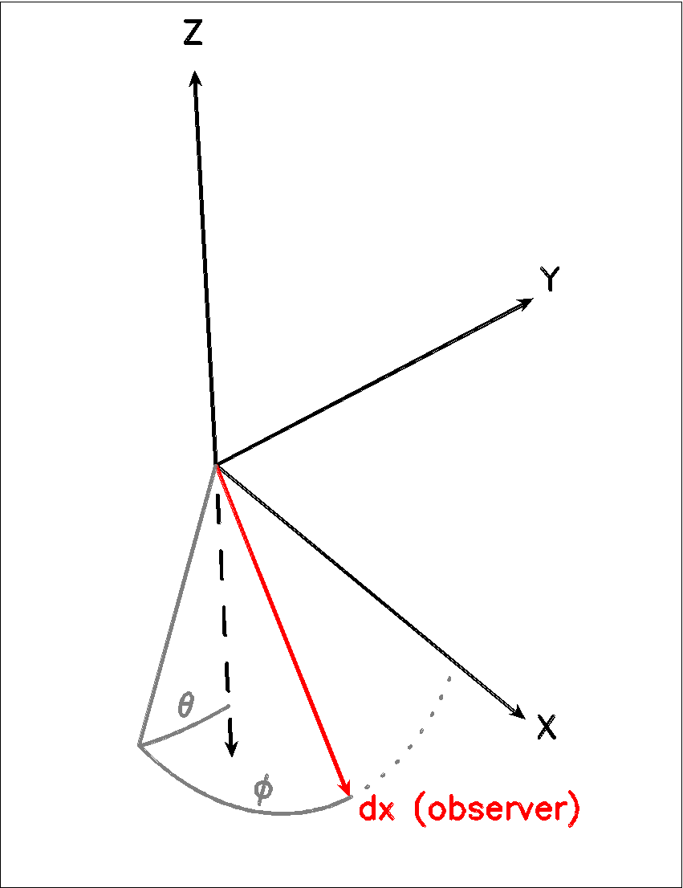

LIME user manual
================

Introduction
------------

Disclaimer
~~~~~~~~~~

We, the authors and maintainers of LIME, do not
guarantee that results given by LIME are correct, nor can we be held
responsible for erroneous results. We do not claim that LIME
is perfect or free of bugs and therefore the user should always take
utmost care when drawing scientific conclusions based on results
obtained with LIME. It is very important that the user performs tests
and sanity checks whenever working with the LIME code to make sure that
the results are reasonable and reliable. In particular, care needs to be
taken when extending the runtime parameters into regimes for which the
code was not designed.

The LIME code
~~~~~~~~~~~~~

LIME (Line Modeling Engine) is an excitation and radiation transfer
code that can be used to predict line and continuum radiation from an
astronomical source model. The code uses unstructured 3D Delaunay
grids for photon transport and accelerated Lambda Iteration for
population calculations.

LIME was developed for the purpose of predicting the emission signature
of low-mass young stellar objects, including molecular envelopes and
protoplanetary disks. In principle the method should work for similar
environments such as (giant) molecular clouds, atmospheres around
evolved stars, high mass stars, molecular outflows, etc. As opposed to
most other line radiation transfer codes which are constrained by
cylindrical or spherical symmetry, LIME, being a 3D code, does not impose any such
geometrical constraints. The main
limitation therefore to what can be done with LIME is the availability of input
models.

LIME is distributed under a Gnu General Public License.

Any publication that contains results obtained with the LIME code should cite the publication
Brinch & Hogerheijde, A&A, 523, A25, 2010.

Development history
~~~~~~~~~~~~~~~~~~~

The initial LIME code was written by Christian Brinch
between 2006 and 2010, with version 1.0 appearing in early 2010. LIME
derives from the radiation transfer code RATRAN developed by
Michiel R.  Hogerheijde and Floris van der Tak (Hogerhijde & van der
Tak, 2000), although after several rewrites, the shared codebase is
very small. The photon transport method is a direct implementation of
the SimpleX algorithm (Ritzerveld & Icke, 2006).

Subsequent to the creation of the package by Christian Brinch, contributors to LIME have included:

- Tuomas Lunttila
- Sébastien Maret
- Marco Padovani
- Sergey Parfenov
- Reinhold Schaaf
- Anika Schmiedeke
- Ian Stewart
- Miguel de Val-Borro
- Mathieu Westphal

LIME is at present in a somewhat awkward phase of development in which many new ways to do things have been added to the code, while still making every effort to preserve backward compatibility - i.e. to allow users not only to run LIME with their old model files, but also to obtain output from that which is as near as possible the same as previously (except for corrections to errors and bugs). At some point however we will have to abandon backward compatibility, but that will also give us the opportunity to put the parameter interface on a more systematic and less idiosyncratic basis. So, watch this space...

Obtaining LIME
~~~~~~~~~~~~~~

The LIME code can be obtained from gitHub at `<https://github.com/lime-rt/lime>`_. The available files include the source code,
this documentation, and an example model. The documentation can be read on line at `<https://readthedocs.org/projects/lime/>`_.

In the remainder of this documentation it will be assumed that the user has unpacked LIME into a directory LimePackage.

Requirements
~~~~~~~~~~~~

LIME runs on any platform with an ANSI C compiler. Most modern operating
systems are equipped with the GNU gcc compiler, but if it is not already
present, it can be obtained from the GNU website (http://www.gnu.org).
Furthermore, LIME needs a number of libraries to be present, including
ncurses, GNU scientific Library (GSL), cfitsio, and qhull. Please refer
to the README file within the LimePackage for details on how to obtain
and install these libraries on various systems. Although it is not
strictly needed for LIME to run, it is useful to have some kind of
software that can process FITS files (IDL, CASA, MIRIAD, etc.) in order
to be able to extract science results from the model images.

There are no specific hardware requirements for LIME to run.
A fast computer is recommended (>2 GHz) with a reasonable amount of
memory (>1 GB), but less will do as well. LIME can be run in multi-threaded
(parallel) mode, if several CPUs are available. It is also possible to
run several instances of LIME simultaneously on a
multi-processor machine with enough memory.

Setting up LIME
~~~~~~~~~~~~~~~

LIME is compiled at run time, so there is no need to make any kind of
pre-installation of the code. The only requirement for the code to run
is that the path to `lime` script is in the PATH environment
variable.

.. note::

   Starting with LIME 1.5, sourcing the `sourceme.bash` or
   `sourceme.bash` (depending on your SHELL type) is not needed
   anymore.

Running LIME
~~~~~~~~~~~~

Once the PATH variable is set, LIME can be run from the command
line

::

    lime model.c

where model.c is the file containing the model (this file can have any
name). This will cause the code to be compiled and the terminal window
should change and display the progress of the calculations. After
completion, the user is prompted to press a key which will bring the
terminal window back. It is possible to run LIME in silent mode, that
is, without any output in the terminal window. This is done by setting
the silent flag to 1 (the default setting is 0) in the file
LimePackage/src/lime.h. LIME also accepts several
:ref:`command line options <lime-options>`.

The inner workings of LIME
~~~~~~~~~~~~~~~~~~~~~~~~~~

The first thing that happens after compilation is that LIME allocates
memory for the grid and the molecular data based on the parameter
settings in the model file. All user defined settings are checked for
sanity and in case there are inconsistencies, LIME will abort with an
error message. It then goes on to generate the grid (unless a predefined
grid is provided) by picking and evaluating random points until enough
points have been chosen to form the grid. It is desirable to avoid oddly-shaped Delaunay triangles, and this is accomplished in one of two ways, depending on the setting chosen for the parameter :ref:`par->samplingAlgorithm <par-samplingAlgorithm>`. With choice 1, the initial grid points are selected using a quasi-random algorithm which avoids too-close pairs of points; no further grid processing is necessary after this is done. With choice 0, the initial, random grid is iteratively smoothed. Because the grid needs to be re-triangulated at each iteration, the
smoothing process may take a while. After smoothing, a number of grid
properties (e.g. velocity samples along the point-to-point links) are pre-calculated for later use. Once this stage is complete, the grid is written to file.

When the grid is ready, LIME decides whether to calculate populations or
not, depending on the user's choice of output images and LTE options (see
chapter 2). If one or more non-LTE line images are asked for, LIME will
proceed to calculate the level populations. This too is an iterative
process in which the radiation field and the populations are recalculated
repeatedly. The radiation field is obtained by propagating photons
through the grid, a fixed number for each grid point; using the
resulting radiation field, the code enters a minor iteration loop where
a set of linear equations, determining the statistical equilibrium, are
iterated in order to converge upon a set of populations. This is
done for each grid point in turn. Once all the grid points have
new populations, the process is repeated.

When the solution has converged (actually there is no convergence testing active in present LIME: all it does is run through the number of iterations specified via the :ref:`par->nSolveIters <par-nSolveIters>` parameter), the code will ray-trace the model to
obtain an image. Ray-tracing is done for each user-defined image in
turn. At the end of the ray-tracing, FITS-format image files are written to the
disk, after which the code will clean up the memory and terminate.

.. _lime-options:

Command line options
--------------------

.. note::

   Starting with LIME 1.5, command line options can be used to change
   LIME default behavior without editing the source code.

LIME accepts several command line options:

.. option:: -V

   Display version information

.. option:: -h

   Display help message

.. option:: -f

   Use fast exponential computation. When this option is set, LIME
   uses a lookup-table replacement for the exponential function, which
   however (due to cunning use of the properties of the function)
   returns a value with full floating-point precision, indeed with
   better precision than that for much of the range. Use of this
   option reduces the run time by 25%.

.. option:: -n

   Turn off `ncurses` messages. This is useful when running LIME in a
   non-interactive way.

.. option:: -t

   This runs LIME in a test mode, in which it is compiled with the debugging flag set; fixed random seeds are also employed in this mode, so the results of any two runs will be identical.

.. option:: -p nthreads

   Run in parallel mode with `nthreads`. The default is a single thread,
   i.e. serial execution.

.. note::

   The number of threads may also be set with the :ref:`par->nThreads <par-nthreads>`
   parameter. This will override the value set via the -p option.

Setting up models
-----------------

The model file
~~~~~~~~~~~~~~

All basic setup of a model is done in a single file which we refer to as
model.c (although it may be given any name). The file model.c is, as the name
suggests, C source code which is compiled together with LIME at runtime,
and therefore it must conform to the ANSI C standard. Setting up a model
however requires only a little knowledge of the C programming language.
For an in-depth introduction to C the user is referred to “The C
Programming Language 2nd ed.” by Kernighan and Ritchie;
numerous tutorials and introductions can also be found on the Internet. The
file lime\_cs.pdf, contained in the LimePackage directory, is a quick
reference for setting up models for LIME. Please note that all physical
numbers in model.c should be given in SI units. A number of macros are available in the src/lime.h file for easier expression of some quantities: e.g. PI, PC (= the number of metres in a parsec) and AU (= 1 Astronomical Unit in metres).

In most common cases, everything about a model should be described
within model.c. However, model.c can be set up as a wrapper that will
call other files containing parts of the model or even call external
codes or subroutines. Examples of such usage are given below in the
section :ref:`Advanced Setup <advanced-setup>`.

model.c should always begin with the following inclusion

.. code:: c

    #include "lime.h"

to make model.c aware of the global LIME variable structures. Other
header files may be included in model.c if needed, although you may need to modify the Makefile accordingly.

Following the preprocessor
commands, the main model function should appear as

.. code:: c

    void input(inputPars *par, image *img){
      // Define the needed parts of par and img
    }

This function should contain the parameter and image settings.

Parameters
~~~~~~~~~~

A structure named "inputPars" is defined in src/inpars.h. This structure contains
all basic settings such as number of grid points, model radius, input
and output filenames, etc. Some of these parameters always need to be
set by the user, while others are optional with preset default values.
There is an exception to this rule, namely when restarting LIME with
previously calculated populations. In that case, none of the
non-optional parameters are required.

.. code:: c

    (double) par->radius (required)

This value sets the outer radius of the computational domain. It should
be set large enough to cover the entire spatial extend of the model. In
particular, if a cylindrical input model is used (e.g., the input file
for the RATRAN code) one should not use the radius of the cylinder but
rather the distance from the center to the corner of the (r,z)-plane.

.. code:: c

    (double) par->minScale (required)

minScale is the smallest spatial scale sampled by the code. Structures smaller
than minScale will not be sampled properly. If one uses spherical
sampling (see below) this number can also be thought of as the inner
edge of the grid. This number should not be set smaller than needed,
because that will cause an undesirably large number of grid points to end up near the
center of the model.

.. code:: c

    (integer) par->pIntensity (required)

This number is the number of model grid points. The more grid points
that are used, the longer the code will take to run. Too few points
however, will cause the model to be under-sampled with the risk of
getting wrong results. Useful numbers are between a few thousands up to
about one hundred thousand.

.. code:: c

    (integer) par->sinkPoints (required)

The sinkPoints are grid points that are distributed randomly at
`par->radius` forming the surface of the model. As a photon from within
the model reaches a sink point it is said to escape and is not tracked
any longer. The number of sink points is a user-defined quantity since
the exact number may affect the resulting image as well as the running
time of the code. One should choose a number that gives a surface
density large enough not to cause artifacts in the image and low enough
not to slow down the gridding too much. Since this is model dependent, a
global best value cannot be given, but a useful range is between a few
thousands and about ten thousand.

.. _par-samplingAlgorithm:

.. code:: c

    (integer) par->samplingAlgorithm (optional)

If this is left at the default value of 0, grid point sampling is performed according to the LIME<1.7 algorithm, as governed by parameter :ref:`par->sampling <par-sampling>`. If 1 is chosen, a new algorithm is employed which can quickly generate points with a distribution which accurately follows any feasible :ref:`gridDensity <grid-density>` function - including with sharp step-changes. This algorithm also incorporates a quasi-random choice of point candidates which avoids the requirement for the relatively time-consuming post-gridding smoothing phase.

.. _par-sampling:

.. code:: c

    (integer) par->sampling (optional)

The sampling parameter is only read if `par->samplingAlgorithm==0`. It can take values 0, 1 or 2. sampling=0 is used for
uniform sampling in Log(radius) which is useful for models with a
central condensation (i.e., envelopes, disks), whereas sampling=1 gives
uniform-biased sampling in x, y, and z. The latter is useful for models with no
central condensation (molecular clouds, galaxies, slab geometries).

The value sampling=2 was added because the routine for 0 was found not to generate grid points with exact spherical rotational symmetry. The 2 setting implements this now properly; sampling=0 has, however, been retained for purposes of backward compatibility. In practice there is little obvious difference between the outputs from 0 versus 2.

The default value is now sampling=2.

.. code:: c

    (double) par->gridDensMaxLoc[i][j] (optional)

This parameter, which is only read if `par->samplingAlgorithm==1`, allows the user to provide LIME with the location of maxima in the grid point number density function. This is not required, but if the GPNDF is varies over the model field by very many orders of magnitude, it may speed the gridding process if provided.

The parameter is a 2D array: the first index is the number of the maxium, the second is the spatial coordinate. Thus `par->gridDensMaxLoc[2][0]` refers to the X coordinate (coordinate 0) of the 3rd maximum (remember that C always counts from zero!)

.. code:: c

    (double) par->gridDensMaxValues[i] (optional)

This (vector) parameter is only read if `par->samplingAlgorithm==1`. It must be provided if `par->gridDensMaxLoc` is set, and the number of entries must be the same as the number of maxima described by `par->gridDensMaxLoc`.

.. code:: c

    (double) par->tcmb (optional)

This parameter is the temperature of the cosmic microwave background.
This parameter defaults to 2.725K which is the value at zero redshift
(i.e., the solar neighborhood). One should make sure to set this
parameter properly when calculating models at a redshift larger than
zero: TCMB = 2.725(1+z) K. It should be noted that even though LIME can
in this way take the change in CMB temperature with increasing z into account,
it does not (yet) take cosmological effects into account when
ray-tracing (such as stretching of the frequencies when using Jansky as
unit). This is currently under development.

.. _par-moldatfile:

.. code:: c

    (string) par->moldatfile[i] (optional)

Path to the i’th molecular data file. This must be be provided if any line images are specified. It is not read if only continuum images are required.

Molecular data files contain the
energy states, Einstein coefficients, and collisional rates which are
needed by LIME to solve the excitation. These files must conform to
the standard of the LAMDA database
(http://www.strw.leidenuniv.nl/~moldata). Data files can be downloaded
from the LAMDA database but from LIME version 1.23, LIME can also
download these files automatically. If a data file name is give that
cannot be found locally, LIME will try and download the file instead.
When downloading data files, the filename can be give both with and
without the surname .dat (i.e., “co” or “co.dat”). moldatfile is an
array, so multiple data files can be used for a single LIME run. There is
no default value.

.. note::

   A lot of work has been done on the multi-molecule parts of the LIME code for the 1.7 release, and we can say for certain that this facility did not work previously; whether it works now is a bit of an open question. There is a lot of testing here which still needs to be done.

.. code:: c

    (string) par->dust (optional)

Path to a dust opacity table. This must be provided if any continuum images are specified - it is fully optional if only line images are required.

This table should be a two column ascii
file with wavelength in the first column and opacity in the second
column. Currently LIME uses the same tables as RATRAN from Ossenkopf and
Henning (1994), and so the wavelength should be given in microns (1e-6
meters) and the opacity in cm^2/g. This is the only place in LIME where
SI units are not used. There is
no default value. A future version of LIME may allow spatial variance
of the dust opacities, so that opacities can be given as function of x,
y, and z.

.. code:: c

    (string) par->outputfile (optional)

This is the file name of the output file that contains the level
populations. If this parameter is not set, LIME will not output the
populations. There is no default value.

.. code:: c

    (string) par->binoutputfile (optional)

This is the file name of the output file that contains the grid,
populations, and molecular data in binary format. This file is used to
restart LIME with previously calculated populations. Once the
populations have been calculated and the binoutputfile has been written,
LIME can re-raytrace for a different set of image parameters without
re-calculating the populations. There is no default value.

.. code:: c

    (string) par->restart (optional)

This is the file name of a binoutputfile that will be used to restart
LIME. If this parameter is set, all other parameter statements will be ignored and can safely be left out of
the model file. There is no default value.

.. code:: c

    (string) par->gridfile (optional)

This is the file name of the output file that contains the grid. If this
parameter is not set, LIME will not output the grid. The grid file is
written out as a VTK file. This is a formatted ascii file that can be
read with a number of 3D visualizing tools (Visualization Tool Kit,
Paraview, and others). There is no default value.

.. code:: c

    (string) par->pregrid (optional)

A file containing an ascii table with predefined grid point positions.
If this option is used, LIME will not generate its own grid, but rather
use the grid defined in this file. The file needs to contain all
physical properties of the grid points, i.e., density, temperature,
abundance, velocity etc. There is no default value.

.. code:: c

    (integer) par->lte_only (optional)

If non-zero, LIME performs a direct LTE calculation rather than solving for the populations iteratively. This facility is useful for quick checks. The
default is lte\_only=0, i.e., full non-LTE calculation.

.. code:: c

    (integer) par->init_lte (optional)

If non-zero, LIME solves for the level populations as usual, but LTE values are used for the starting values instead of the T=0 values normally used.

.. code:: c

    (integer) par->blend (optional)

If non-zero, LIME takes line blending into account, however, only if there
are any overlapping lines among the transitions found in the
moldatfile(s). LIME will print a message on screen if it finds
overlapping lines. Switching line blending on will slow the code down
considerably, in particular if there is more than one molecular data
file. The default is blend=0 (no line blending).

.. note::

   A great deal of work has been done on the blending code for 1.7. We can say for certain that it did not work before; but whether it works now is a bit of an open question. This is another aspect of LIME which needs both testing and line-by-line code checking.

.. code:: c

    (integer) par->antialias (optional)

This parameter is no longer used, although it is retained for the present for purposes of backward compatibility.

.. code:: c

    (integer) par->polarization (optional)

If non-zero, LIME will calculate the polarized continuum emission. This
parameter only has an effect for continuum images. The resulting image cube will have three channels
containing the Stokes I, Q, and U of the continuum emission (theory says there is zero V component). In order for the polarization to
work, a magnetic field needs to be defined (see below). When
polarization is switched on, LIME is identical to the DustPol code
(Padovani et al., 2012), except that the expression Padovani et al. give for sigma2 has been shown by Ade et al. (2015) to be too small by a factor of 2. This correction has now been included in LIME.

The next three (optional) parameters are linked to the density function you provide in your model file. All three parameters are vector quantities, and should therefore be indexed, the same as :ref:`par->moldatfile <par-moldatfile>` or :ref:`img <images>`. If you choose to make use of any or all of the three (which is recommended though not mandatory), you must supply, for each one you use, the same number of elements as your density function returns. As described below in the relevant section, the :ref:`density function <density>` can return multiple values per call, 1 for each species which is present in significant quantity. The contribution of such species to the physics of the situation is most usually via collisional excitation or quenching of levels of the radiating species of interest, and for this reason they are known in LIME as collision partners (CPs). 

Because there are 2 independent sources of information about these collision partners, namely via the density function on the one hand and via any collisional transition-rate tables present in the moldata file on the other, we have to be careful to match up these sources properly. That is the intent of the parameter

.. code:: c

    (integer) par->collPartIds[i] (optional)

The integer values are the codes given in
`<http://home.strw.leidenuniv.nl/~moldata/molformat.html>`_. Currently
recognized values range from 1 to 7 inclusive. E.g if the only colliding
species of interest in your model is H2, your density function should return a
single value, namely the density of molecular hydrogen, and (if you supply a
collPartIds value at all) you should set collPartIds[0] = 1 (the LAMDA code for
H2). However, if you use collisional partners that are not one of LAMDA 
partners, it is fine to use any of the values between 1 and 7 to match
the density function with collisional information in the datafiles.  Some of
the messages in LIME will refer to the default LAMDA partner molecules, but
this does not affect the calculations. In future we will introduce a better mechanism to allow the user to specify non-LAMDA collision partners.

LIME calculates the number density of each of its radiating species, at each grid point, by multiplying the abundance of the species (returned via the function of that name) by a weighted sum of the density values. The next parameter allows the user to specify the weights in that sum.

.. code:: c

    (double) par->nMolWeights[i] (optional)

An example of when this might be useful is if a density for electrons is provided, they being of collisional importance, but it is not desired to include electrons in the sum when calculating nmol values. In that case one would set the appropriate value of nMolWeights to zero.

The final one of the density-linked parameters controls how the dust mass density and hence opacity is calculated. This again involves a weighted sum of provided density values, and this parameter allows the user to specify the weights to be used.

.. code:: c

    (double) par->dustWeights[i] (optional)

.. note::

   The calculation of dust mass density at present makes use of a hard-wired average gas density value of 2.4, appropriate to a mix of 90% molecular hydrogen and 10% helium. The only way to compensate for this hard-wired value is to scale all the values of `par->dustWeights` accordingly.

If none of the three density-linked parameters is provided, LIME will attempt to guess the information, in a manner as close as possible to the way it was done in version 1.5 and earlier. This is safe enough when a single density value is returned, and only H2 provided as collision partner in the moldata file(s), but more complicated situations can very easily result in the code guessing wrongly. For this reason we encourage users to make use of these three parameters, although in order to preserve backward compatibility with old model.c files, we have not (yet) made them mandatory.

.. code:: c

    (integer) par->traceRayAlgorithm (optional)

This parameter specifies the algorithm used by LIME to solve the radiative-transfer equations during ray-tracing. The default value of zero invokes the algorithm used in LIME<1.6; a value of 1 invokes a new algorithm which is much more time-consuming but which produces much smoother images, free from step-artifacts.

.. note::

   The new algorithm is not yet 'thread-safe', which means you should not run raytracing in parallel if `par->traceRayAlgorithm`=1. We'll work on this.

Note also that there have been additional modifications to the raytracing algorithm which have significant effects on the output images since LIME-1.5. Image-plane interpolation is now employed in areas of the image where the grid point spacing is larger than the image pixel spacing. This leads both to a smoother image and a shorter processing time.

.. _par-nthreads:

.. code:: c

    (integer) par->nThreads (optional)

If set, LIME will perform the most time-consuming sections of its calculations in parallel, using the specified number of threads. Serial operation is the default. This parameter overrides any value supplied to LIME on the command line.

.. _par-nSolveIters:

.. code:: c

    (integer) par->nSolveIters (optional)

This defines the number of solution iterations LIME should perform when solving non-LTE level populations. The default is currently 17. 

.. code:: c

    (integer) par->resetRNG (optional)

If this is set non-zero, LIME will use the same random number seeds at the start of each solution iteration. This has the effect of choosing the same photon directions and frequencies for each iteration (although the directions and frequencies change randomly from one grid point to the next). This has the effect of decoupling any oscillation or wandering of the level populations as they relax towards convergence from the intrinsic Monte Carlo noise of the discrete solution algorithm. Best practice might involve alternating episodes with `par->resetRNG` =0 and 1, storing the intermediate populations via the :ref:`I/O interface <grid-io>`. Very little experience has been accumulated as yet with this facility.

The default value is 0.

.. _grid-io:

.. code:: c

    (string) par->gridOutFiles[i] (optional)

Up to 4 file names can be provided to this parameter, which allows LIME to write the entire grid information to file at each of four defined stages of completeness. Broadly speaking these stages are (i) grid points chosen, (ii) Delaunay tetrahedra calculated, (iii) user-provided functions sampled, (iv) populations solved. Any of these files can be read in again via the `par->gridInFile` parameter: LIME will calculate the stage from the information present in the file.

The only file format available at present is FITS, but it is also planned to write an HDF5 backend.

.. code:: c

    (string) par->gridInFile (optional)

This file should conform to the format described in the header of src/grid2fits.c. (Files written by LIME to one of the recognized four `par->gridOutFiles` stages automatically conform to this format.) LIME will not recalculate any information it finds in the file. The user may, for example, perform several iterations of population solution, store this information by providing a file name to `par->gridOutFiles[3]` (remember C counts from zero!), then read it back in again via `par->gridInFile` without going through the gridding stage again. This allows solution to be decoupled from raytracing.

These last two parameters mostly replace the functionality of the older `par->outputfile`, `par->binoutputfile`, `par->pregrid`, `par->restart` parameters. These may be abolished in a future version of LIME. Note that `par->gridfile` is still however of use.

.. _images:

Images
~~~~~~

LIME can output a number of images per run. The information about each
image is contained in a structure array called img. The images defined
in the image array can be either line or continuum images or both. All
definitions of an image may be different between images (i.e., distance,
resolution, inclination, etc.) so that a number of images with varying
source distance or image resolution can be made in one go. In the
following, i should be replaced by the image number (0, 1, 2, ...).

.. code:: c

    (integer) img[i]->pxls (required)

This is the number of pixels per spatial dimension of the FITS file.
The total amount of pixels in the image is thus the square of this
number.

.. code:: c

    (double) img[i]->imgres (required)

The image resolution or size of each pixel. This number is given in arc
seconds. The image field of view is therefore pxls x imgres.

.. code:: c

    (double) img[i]->distance (required)

The source distance in meters. LIME predefines macros PC and AU which express respectively the sizes of the parsec and the Astronomical Unit in meters, so it is valid to write the distance as 100\*PC for example. If
the source is located at a cosmological distance, this parameter is the
luminosity distance.

Note that LIME assumes far-field geometry - you will get a distorted image if `img[i]->distance` is not much greater than the model radius.

.. code:: c

    (integer) img[i]->unit (required)

The unit of the image. This variable can take values between 0 and 4. 0
for Kelvin, 1 for Jansky per pixel, 2 for SI units, and 3 for Solar
luminosity per pixel. The value 4 is a special option that will create
an optical depth image cube (dimensionless).

.. code:: c

    (string) img[i]->filename (required)

This variable is the name of the output FITS file. It has no default value.

.. code:: c

    (double) img[i]->source_vel (optional)

The source velocity is an optional parameter that gives the spectra a
velocity offset (receding velocities are positive-valued). This parameter is useful when comparing the model to an
astronomical source with a known relative line-of-sight velocity.

.. code:: c

    (integer) img[i]->nchan (semi optional)

nchan is the number of velocity channels in a spectral image cube. See
the :ref:`note below ` for additional information.

.. code:: c

    (double) img[i]->velres (semi optional)

The velocity resolution of the spectral dimension of the FITS file (the
width of a velocity channel). This number is given in m/s. See the :ref:`note below ` for additional information.

.. code:: c

    (double) img[i]->bandwidth (semi optional)

With of the spectral axis in Hz. See the :ref:`note below ` for additional
information.

.. code:: c

    (integer) img[i]->trans (semi optional)

The transition number, used to determine the image frequency when ray-tracing line images. This number refers
to the transition number in the molecular data files. Contrary to the
numbers in the data files, trans is zero-index, meaning that the first
transition is labeled 0, the second transition 1, and so on. For linear
rotor molecules without fine structure transition in their data files
(CO, CS, HCN, etc.) the trans parameter is identified by the lower level
of the transition. For example, for CO J=1-0 the trans label would be
zero and for CO J=6-5 the trans label would be 5. For molecules with a
complex level configuration (e.g., H2O), the user needs to refer to the
datafile to find the correct label for a given transition. See the :ref:`note below ` for additional information.

.. code:: c

    (integer) img[i]->molI (optional)

If `img[i]->trans` is set, this parameter will also be read, although to preserve backward compatibility it is not at present required. This refers to the molecule whose transition should be used. Its default value is zero.

.. code:: c

    (double) img[i]->freq (semi optional)

Center frequency of the spectral axis in Hz. This parameter can be used
for both line and continuum images. See the :ref:`note below ` for additional
information.

.. _img-semi:

Note on semi-optional image parameters
~~~~~~~~~~~~~~~~~~~~~~~~~~~~~~~~~~~~~~

The interaction between image parameters is complicated and potentially confusing. The key to understanding which of the image parameters you have to supply under what circumstances is to realize that LIME has to deduce three things from the image parameters: (i) whether the desired image is line or continuum, (ii) the image frequency, (iii) (for line images) the number and width of spectral channels.

  1. If the user sets either `img[i]->nchan` or `img[i]->velres`, LIME will assume they want a line image. Img fields nchan, trans, molI, velres and bandwidth are ignored for a continuum image.

  2. `img[i]->freq` is the only way a user can set image frequency for a continuum image. For a line image, LIME looks first for `img[i]->trans`, and will obtain the image frequency from that (in conjunction with the mol data) if set; if not, it needs `img[i]->freq`.

  3. To calculate the channel number and spacing, LIME needs 2 out of the 3 parameters `img[i]->bandwidth`, `img[i]->velres` or `img[i]->nchan` to be set. If all three are set, `img[i]->nchan` will be overwritten by a calculation using the other 2.

   The cartesian coordinate system used by LIME, showing the direction of the observer (red arrow) and the relation to the axes of the user-specifiable angles theta and phi.

Image rotation parameters
~~~~~~~~~~~~~~~~~~~~~~~~~

There are now two ways to specify the desired orientation of the model at the raytracing step: we have retained the old theta/phi angles, but have now added a new triplet: azimuth/inclination/PA. None of these five parameters is now mandatory. If none are provided, theta=phi=0 will be assumed. If you provide all three azimuth/inclination/PA values, these will be used instead of theta/phi, regardless if you also set either or both of theta/phi.

Note that all of these angles should be given in radians. You can however use the predefined PI macro for this: e.g. to express π/2, write PI/2.0 in your model file.

The rotation parameters in detail:

.. code:: c

    (double) img[i]->theta (optional)

Theta is the vertical viewing angle (the vertical angle between the model z axis and the
ray-tracer's line of sight). A face-on view (of models where this term is
applicable) is 0 and edge-on view is π/2. The default value is 0.

.. code:: c

    (double) img[i]->phi (optional)

Phi is the horizontal viewing angle (the horizontal angle between the model z axis and the
ray-tracer's line of sight). A face-on view (of models where this term is
applicable) is 0 and edge-on view is π/2. The default value is 0.

If theta/phi are applied, for zero values of both the model X axis points to the left, Y points upward and Z points in the direction of gaze of the observer (i.e. away from the observer).

.. code:: c

    (double) img[i]->azimuth (optional)

Azimuth rotates the model from Y towards X.

.. code:: c

    (double) img[i]->incl (optional)

Inclination rotates the model from Z towards X.

.. code:: c

    (double) img[i]->posang (optional)

Position angle rotates the model from Y towards X.

If azimuth/incl/posang are applied (i.e. if all three values are supplied in your model.c), for zero values of all the model X axis points downward, Y points toward the right and Z towards the observer.

Model functions
---------------

The second part of the model.c file contains the actual model
description. This is provided as eight subroutines: density, molecular
abundance, temperature, systematic velocities, random velocities,
magnetic field, gas-to-dust ratio, and grid-point number density. The user only needs to provide
the functions that are relevant to a particular model, e.g., for
continuum images only, the user need not include the abundance function
or any of the velocity functions. The magnetic field function needs only
be included for continuum polarization images.

Note that you should avoid singularities in these functions - i.e., places where LIME might attempt to divide by zero, or in some other way generate an overflow.

.. _density:

Density
~~~~~~~

The density subroutine contains a user-defined description of the 3D density profile of the collision partner(s).

.. code:: c

    void
    density(double x, double y, double z, double *density){
      density[0] = f(x,y,z);
      density[1] = f(x,y,z);
      ...
      density[n] = f(x,y,z);
    }

LIME can at present only deal with 7 collision partners (CPs), namely those listed in the LAMDA database. In most cases, a single density profile will suffice. Note that the number of returned density function values no longer has to be the same as the number of CPs listed in the moldata file(s) so long as the user sets values for the collPartIds parameter; but if this parameter is not supplied, and the numbers are different, LIME may not be able to match the CPs associated with each density value to those in the moldata file(s). Note also that moldata CPs for which there is no matching density will be ignored.

The density is a number density, that is, the number of molecules of the respective CP per unit volume (in cubic meters, not cubic centimeters).

Molecular abundance
~~~~~~~~~~~~~~~~~~~

The abundance subroutine contains descriptions of the molecular abundance profiles of the radiating species in the input model. The number of abundance profiles should match exactly the number of molecular data files defined in `par->moldatfile`.

.. code:: c

    void
    abundance(double x, double y, double z, double *abundance){
      abundance[0] = f(x,y,z);
      abundance[1] = f(x,y,z);
      ...
      abundance[n] = f(x,y,z);
    }

The abundance is the fractional abundance with respect to a weighted sum of the densities supplied for the collision partners. If the user does not supply the weights via the nMolWeights parameter, the code will try to guess them.

Abundances are dimensionless.

Temperature
~~~~~~~~~~~

The temperature subroutine contains the descriptions of the gas, and
optionally, the dust temperature.

.. code:: c

    void
    temperature(double x, double y, double z, double *temperature){
      temperature[0] = f(x,y,z);
      temperature[1] = f(x,y,z);
    }

The entry 0 in the temperature array is the kinetic gas temperature.
This value is required for LIME to run. The entry 1 is the optional dust
temperature. Both are in Kelvin. If there is no explicit dust
temperature given in the temperature subroutine, LIME will assume that
the dust temperature equals the gas temperature.

Random velocities
~~~~~~~~~~~~~~~~~

This subroutine contains a scalar field which describes the velocity
dispersion of the random macroscopic (i.e. turbulent) motions of the gas. When added in quadrature to the thermal Doppler broadening specific to each molecule, this number gives the Doppler
b-parameter which is the 1/e half-width of the line profile. The doppler
subroutine differs from the other model subroutine in that
the return type is a scalar, and not an array. The doppler value
should be given in m/s.

.. code:: c

    void
    doppler(double x, double y, double z, double *doppler){
      *doppler = f(x,y,z);
    }

Because the return type is a scalar, the asterisk in front of the
variable name needs to be present. doppler[0] does not work.

Velocity field
~~~~~~~~~~~~~~

The velocity field subroutine contains the systematic velocity field of
the gas. The return type of this subroutine is a three component vector,
with components for the x, y, and z axis.

.. code:: c

    void
    velocity(double x, double y, double z, double *velocity){
      velocity[0] = f(x,y,z);
      velocity[1] = f(x,y,z);
      velocity[2] = f(x,y,z);
    }

In LIME 1.7 the previous 'spline' estimation (which was actually a polynomial interpolation) of velocities along the links betwene grid points has been replaced by a simpler system in which the velocity is sampled at (currently 3) equally-spaced intervals along each link, as well as at the grid cells. These link values are stored and used to estimate the average line amplitude per link via an error-function lookup. Ideally we would not need to call the velocity function again, but would be able to restrict calls of it (as is the case with all the other functions) purely to the gridding section. However it is found that linear interpolation of velocity within Delaunay cells at the raytracing is insufficient to produce accurate images; thus velocity is still called during the raytracing. In the near future we will try a 2nd-order in-cell interpolation, and if that proves adequate, we will have succeeded in relegating velocity calls to the gridding section alone.

Magnetic field
~~~~~~~~~~~~~~

This is an optional function which contains a description of the magnetic
field. The return type of this subroutine is a three component vector,
with components for the x, y, and z axis. The magnetic field only has an
effect for continuum polarization calulations, that is, if
`par->polarization` is set.

.. code:: c

    void
    magfield(double x, double y, double z, double *B){
      B[0] = f(x,y,z);
      B[1] = f(x,y,z);
      B[2] = f(x,y,z);
    }

Gas-to-dust ratio
~~~~~~~~~~~~~~~~~

The gas-to-dust ratio is an optional function which the user can
choose to include in the model.c file. If this function is left out,
LIME defaults to a dust-to-gas ratio of 100 everywhere. This number only
has an effect if the continuum is included in the calculations.

.. code:: c

    void
    gasIIdust(double x, double y, double z, double *gtd){
      *gtd = f(x,y,z);
    }

.. _grid-density:

Grid point number density
~~~~~~~~~~~~~~~~~~~~~~~~~

In LIME 1.5 and earlier, the number density of the random grid points was tied directly to the density of the first collision partner. The newly introduced function gridDensity now gives the user the ability to option this link and specify the grid point distribution as they please. Note that LIME defaults to the previous algorithm if the function is not supplied.

.. code:: c

    double
    gridDensity(configInfo *par, double *r){
      double fracDensity;
      fracDensity = f(r);
      return fracDensity;
    }

Notes:
  1. The returned variable is a scalar.
  2. This is the only function which includes the input parameters among the
     arguments. You cannot write to these, they are only supplied so that you
     can use their values if you wish to.
  3. Note that ``fracDensity`` is interpreted as a relative value. LIME will scale the integral of the gridDensity function to the desired number of internal points set by the user via the parameter `par->pIntensity`.
  4. If you leave `par->samplingAlgorithm` at its default of 0, but wish nevertheless to define a non-default gridDensity function, be aware that these two algorithms are a poor match, since they are built on different assumptions. You will need to make sure that
     ``gridDensity()`` returns ``fracDensity=1`` for at least **one**
     location in the model space in this case. Functions without steps are also
     recommended for `par->samplingAlgorithm`==0.

Other settings
~~~~~~~~~~~~~~

A number of additional settings can be found in the file
LimePackage/src/lime.h. These settings should in general not be changed
by the user, unless there is an explicit need to do so. A few of them
however could be useful to some users. The keyword ``silent`` which is by
default set to zero can be set to one. This will cause LIME to run
completely silent with no output to the screen at all. This can be
useful for running LIME in batch mode in the background.

.. _advanced-setup:

Advanced setup
~~~~~~~~~~~~~~

Standard use of LIME requires the user to formulate the model in the
model functions described above as either an analytical expression or a
look-up table of values. As input models increase in complexity however,
analytical descriptions may no longer be possible and with model
dimensionality higher than one, look-up tables become difficult to
manage within the model.c functions. In the following we will explain
how to use complex numerical models and pre-gridded models as input for
LIME.

Using numerical input models
~~~~~~~~~~~~~~~~~~~~~~~~~~~~

Numerical input model can roughly be divided into two groups: those
where the model properties are described as cell averages and those
where the model properties are described at cell nodes (see figure). In
either case, LIME will send a coordinate to the model functions and
expect a value back. It is then up to the user to write an interface that
will look up the appropriate return value.

In the simplest case where the numerical model is described as cell
averaged values, the user needs to loop through the cells and find the
cell in which the LIME point falls and return the value of that
particular cell. In the case where the model is described on cell nodes,
the user must loop through the nodes to find the node which lies closest
to the LIME point and return that node value. This approach obviously
limits the LIME model smoothness to the input model resolution since all
LIME points which fall within an input model grid cell (or within a
certain distance from a grid node) get the same value. One way to get
around this is to interpolate in the input grid, which in principle can
be done in either case, although this may be highly non-trivial if the
model is described on unstructured grid nodes or is of a dimensionality
greater than one. An example of linear interpolation in a one
dimensional table can be found in the example model.c file below.

In the special case where the input model is described on unstructured
grid nodes (e.g., Smoothed Particle Hydrodynamics simulations) the input
grid can be used directly in LIME. This requires the user to set the
`par->pregrid` parameter.

If the user is more comfortable writing code in the FORTRAN language, it
is possible to use the model subroutines as wrappers to call FORTRAN
functions which then carry out any necessary calculations and return
the values to model.c. This can be done the following way:

.. code:: c

    void
    density(double x, double y, double z, double *density){
      fortransub_(&x, &y, &z, &density[0]);
    }

.. code:: fortran

    SUBROUTINE fortransub(x,y,z,temp)
    DOUBLE x,y,z,temp
    temp=f(x,y,z)
    RETURN
    END

In order for this to work the file containing the FORTRAN function needs
to be compiled by a FORTRAN compiler and the resulting object file needs
to be linked with LIME. This only works if the linking is also done with
the FORTRAN compiler, so some modification to the Makefile is needed.
Notice that the underscore after the name of the FORTRAN subroutine in
the C function call has to be present. Please note that the example
above is untested and may need modification in order to work.

If the input model file consist of a table of values, for instance as
when using the output of another code as input for LIME, the idea is
look up the input grid point (or cell) which is closest to the LIME grid
point in question (or for cell based tables, the cell in which the LIME
point falls). The way to deal with this is to make a column formatted
ascii file with the input model:

::

    x_1 y_1 z_1   density_1   temperature_1   any_other_stuff_1   ...
    x_2 y_2 z_2   density_2   temperature_2   any_other_stuff_2   ...
    ...
    x_n y_n z_n   density_n   temperature_n   any_other_stuff_n   ...

The idea is to find the i'th entry in that list where
minimum((x\_i-x)2+(y\_i-y)2+(z\_i-z)2) is true, or in other words which
entry in the list lies closest to a given LIME point (x,y,z). One way to
solve this would be as follows (example in pseudocode)

.. code:: c

    density(x,y,z){
     mindist=very_large_number
     open("model_input_file",read)
     while not end-of-file{
       read_one_line(x_i,y_i,z_i,density_i,...)
       calculate distance from (x,y,z) to (x_i,y_i,z_i) == dist
       if dist < mindist then {
         mindist = dist
         bestdensity = density_i
       }
     }
     close(file)
     return bestdensity
    }

and similarly for the temperature and other properties. This is
potentially a slow process, opening and closing a file for every grid
point. To speed up the process, it is useful to make the model columns
available as arrays in model.c. This can be done by formatting the
columns using proper C-syntax as arrays and putting them in a “header”
file that can be included in model.c

.. code:: c

    int size=numer_of_lines_in_model_file;
    double model_x[size]={x1,x2,...,xn};
    double model_y[size]={y1,y2,...,yn};
    double model_z[size]={z1,z2,...,zn};
    double model_density[size]={density1,density2,...,densityn};
    ...

The pseudocode example from above now reads:

.. code:: c

    density(x,y,z){
     mindist=very_large_number
     for i from 0 to size by 1
       calculate distance from (x,y,z) to (model_x[i],model_y[i],model_z[i]) == dist
       if dist < mindist then {
         mindist = dist
         bestdensity = model_densiy[i]
       }
     }
     return bestdensity
    }

RATRAN models as input for LIME
~~~~~~~~~~~~~~~~~~~~~~~~~~~~~~~

It is possible to use existing 1D or 2D model files from the RATRAN code
in LIME. This is done with ratranInput() subroutine. The .mdl file has
to comply with the RATRAN standard and the header (everything above the
@ sign) of the file needs to be intact. The functions in model.c look
like this

.. code:: c

    void
    density(double x, double y, double z, double *density){
      density[0]=ratranInput("model.mdl", "nh", x,y,z)*1e6;
    }

and

::

    void
    temperature(double x, double y, double z, double *temperature){
      temperature[0]=ratranInput("model.mdl", "te", x,y,z);
    }

for the density and temperature respectively. Notice that the density is
multiplied by 1e6 to convert the cgs units from RATRAN into LIMEs SI
units. The calls to the subroutine for the doppler velocity, systemic
velocity, dust temperature, and abundance are similar, using the
appropriate keywords to identify the column in the RATRAN .mdl file.
Since RATRAN uses molecular density and not abundance, the abundance
function should read

.. code:: c

    void
    abundance(double x, double y, double z, double *abundance){
      abundance[0]=ratranInput("model.mdl","nh",x,y,z)/ratranInput("model.mdl","nm", x,y,z);
    }

Obviously it is possible to mix RATRAN input, that is, using different
.mdl files for the different functions. All parameters in model.c still
need to be set, ie., `par->radius`, even though this information is
contained in the RATRAN header. If the RATRAN grid is not
logarithmically spaced, it may be advantageous to set `par->sampling`=1.

Output from LIME
----------------

Besides the FITS images, which are the main output, LIME produces other
output that can be used not only for diagnostics but also science
results. This chapter describes the various output files and how to work
with them.

The grid
~~~~~~~~

Once the Delaunay grid has been created by LIME, a VTK file with the
grid and grid properties are written (if the parameter `par->gridfile` is
set, see chapter 2). The VTK (Visualization Tool Kit) format is a
formatted ascii file that are used to handle geometrical objects, in our
case an unstructured grid. VTK files can be read by several
visualization software packages. In particular we advocate the use of
paraview (http://www.paraview.org) which is an open source program
available for several platforms.

The grid file contains the (x,y,z)-coordinate of each grid point, as
well as a reference to the neighbors of each grid point. From this
information the Delaunay triangulation can be reconstructed. The file
also holds three scalar fields and a vector field for the H2 density,
temperature, molecular density and the velocity field. Other properties
could be written out as well, but that will require the user to edit the
write\_VTK\_unstructured\_Points() function in grid.c.

Inspecting the grid using paraview can be a useful way to make sure that
the model indeed behaves as expected. It makes for impressive
visualizations that can be included in presentations. However, paraview
does a poor job when it comes to publication quality plots.

Populations
~~~~~~~~~~~

The level populations are written out in a separate file if LIME is set
up to calculate the level populations, that is, if at least one
molecular data file is defined in model.c (and if the parameter
`par->outputfile` is set). Currently, LIME can only write out populations
from the first molecule (`par->moldatfile[0]`). The populations output
file contains the x, y, and z coordinates for each grid point as well as
the H2 density, temperature, and molecular density besides the level
populations. Contrary to the grid file, it does not, however, contain
information about the neighbors of the grid points and therefore, the
Delaunay triangulation cannot be reconstructed from this file (unless
the points are re-triangulated with qhull or a similar tool). The
information in the population file allows the user to plot projections
and slices of the model properties including the populations. This is
the best way to directly compare the LIME model and the result of the
excitation calculation with the results obtained by other codes. One
particularly interesting property to plot is the excitation temperature

.. math::

    \frac{n_u}{n_l} = \frac{g_u}{g_l} \, \mathrm{exp} \left( -
    \frac{\Delta E}{k_B \, T_{ex}} \right)

which is obtained from the level populations. u and l refers to the
upper and lower level and g are the statistical weights. Calculating the
excitation temperature is the best way to check for masering in the
model since the excitation temperature turns negative in the case of
population inversion. If, and only if, the gas is in local thermodynamic
equilibrium (LTE) the excitation temperature equals the kinetic
temperature, so plotting the ratio of kinetic gas temperature to the
excitation temperature gives a measure of the deviation from LTE.

Images
~~~~~~

Image cubes are the main output from LIME. LIME produces model images in
the FITS file format only.

Post-processing
---------------

In order to make direct comparisons between LIME models and
observations, some kind of post-processing of the images will be needed
in almost all cases. In this chapter we will give some hints and tricks
to how this can be done using readily available software packages.

Convolution
~~~~~~~~~~~

In order to compare LIME results to single dish observations, the image
cube needs to be convolved with a beam profile that corresponds to the
instrument beam at the frequency in question. Before convolving am image
it is important to make sure that the image is larger that the beam size
and that the beam is resolved by the pixels (pixel size << beam size).
The reason that the image needs to be bigger that the beam is to avoid
artificial edge effects at the corners of the image. This is not very
important if only the spectrum toward the center of the image is of
interest, but if the image is being used as a model of a single dish
map, edge effects become important. In general, it is recommended that
the image is made large enough that the emission has dropped
sufficiently close to zero at the edges of the image.

If the beam size is small, it may be an issue that the beam is not
sufficiently resolved by pixels.This is important to make sure that
structures that are picked up by the telescope beam is sufficiently
sampled by the ray-tracer in LIME. In general it is a good idea to
calculate the image in a considerably higher resolution than what is
needed, because artifacts in the image that are due to the randomness of
the grid are then smoothed out. In order to compare a convolved model
spectrum to a single observed spectrum toward the source center, the
spectrum at the center pixel should be used without additional averaging
of pixels.

When comparing model images to interferometric observations, there is no
need to convolve the image with a beam profile. In this case, model and
data is compared in frequency space in which case the model image needs
to be Fourier transformed or in image space in which case the model
should be sampled with the (u,v)-spacing from the dataset and inverted
and cleaned using the same process as the observed data has gone
through. When Fourier transforming the model image, one should be
careful to avoid aliasing effects that are caused by the regularity of
the pixel grid. Such effects are model dependent and difficult to
prevent entirely. On the other hand, comparing the model to
interferometric data in image space is dangerous as well, because of the
non-uniqueness of the de-convolved image.

Both convolution and Fourier transforming can be done using the MIRIAD
tasks convolve and fft after converting the FITS file into MIRIAD format
using the MIRIAD task fits. Both convolution and Fourier transformation
can be done in IDL or Python.

Plotting the model
~~~~~~~~~~~~~~~~~~

The LIME data cubes can be visualized in numerous ways, both in one and
two dimensions. One dimensional plots include the spectrum of a single
pixel and the brightness profile along either spatial direction a a
specific frequency or summed over a range of frequencies. The two
dimensional (contour) plots are images when done in the plane spanned by
the two spatial axis, and position-velocity (PV) diagrams when done in
the frequency and any one of the spatial axis.

When plotting images, it is often useful to sum over a range of
frequencies. This results in, what is know as, moment maps. These can be
made to any order, but zero and first moments are most often used. The
nth moment is defined as

.. math::

    \mu_n \left( x , y \right) = \int_{-\infty}^{\infty} \left( v -
    v_\mathrm{source} \right)^n \, I \left( x , y , z \right) \, dv

Sometimes the first moment (and also higher order moments) is normalized
by the zero moment.

Ideas for LIME 2.0
------------------

In the following we list a number of new features which are being
considered for the next major release of LIME. Users should feel free to
contact the maintainers with suggestions, improvements, new functionalities
or bugs needing to be fixed.

-  Line polarization
-  Visibility output
-  Tau images
-  User-defined, function based grid sample weights
-  Basecol/Vamdc support
-  etc...

Appendix: Bibliography
----------------------

-  Ade et al., A&A 576, A105 (2015)
-  Brinch & Hogerheijde, A&A, 523, A25, 2010; see also
   http://www.nbi.dk/~brinch/lime.php
-  Hogerheijde & van der Tak, A&A, 362,697, 2000
-  Ritzerveld & Icke, PhysRevE, 74, 26704, 2006
-  Ossenkopf & Henning, A&A, 291, 943, 1994
-  Kernighan & Ritchie, “The C Programming Language 2nd ed.”, Prentice
   Hall, 1988, ISBN-13: 978-0131103627
-  Padovani et al., A&A, 543, A16, 2012

